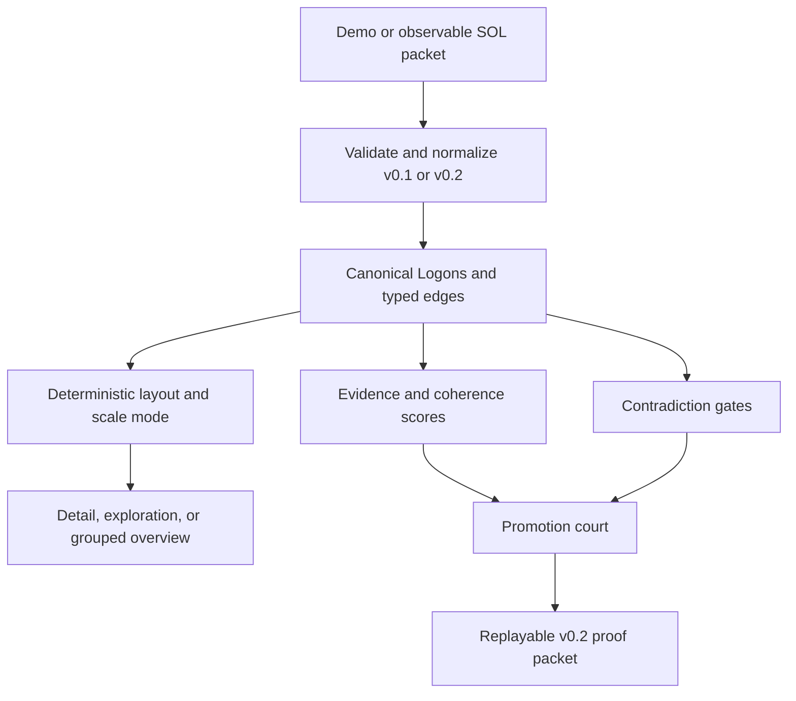

# SOL Lens

**A semantic trace and migration workbench for GPT-5.6 agent workflows, built on the SOL Engine.**

[Open the live prototype](https://sol-lens.techman-stud-2096.chatgpt.site)

SOL Lens answers a deceptively hard migration question: *did the new model actually make the agent better?* It compares observable baseline and candidate traces, compiles the trace into atomic semantic units called **Logons**, scores the resulting evidence structure, and issues a deterministic promotion verdict.

The Phase 2 workbench remains credential-free, but it is no longer fixture-bound: users can load, drop, or paste observable SOL packets, replay their evaluation locally, explore the resulting graph at multiple scales, and export a complete packet for another lossless replay. The checked-in ten-Logon demo remains a one-click fallback.

## What the prototype demonstrates

- GPT-5.5 baseline and GPT-5.6 Sol candidate comparison
- v0.2 packet import with strict validation and safe v0.1 normalization
- deterministic, cycle-aware Logon layout with supported, inferred, and contradictory units
- automatic detail, exploration, and grouped overview modes
- pointer-centered zoom, background pan, fit/reset, group focus, and keyboard selection
- per-Logon evidence density (`rho`), semantic pressure (`p`), and governance alignment (`psi`)
- aggregate evidence, coherence, and contradiction scoring
- deterministic **PROMOTE / HOLD / QUARANTINE** court
- claimed-versus-recomputed evaluation comparison
- downloadable v0.2 JSON proof packet with typed edges
- accessible keyboard interaction and responsive dashboard layout

## Why this is a meaningful SOL Engine extension

The pre-existing SOL Engine supplied the semantic and mathematical foundation. SOL Lens is the new product layer created for OpenAI Build Week beginning July 18, 2026:

- a GPT-5.5 to GPT-5.6 migration use case
- an observable trace contract
- an interactive semantic graph
- deterministic promotion gates
- a replayable proof-packet schema
- a new Vinext/React implementation and visual system

See [PROVENANCE.md](./docs/PROVENANCE.md) for the clean boundary between the foundation and the new extension.

## SOL scoring profile

The demo engine aggregates only observable Logon fields. For a trace `L`:

```text
evidence      = mean(evidence_i) for non-contradictory Logons
contradiction = contradictory Logons / (all Logons + stabilizer)
coherence     = .45(evidence) + .42(mean psi) + .13(1 - mean pressure)
```

The promotion court then applies explicit gates:

| Verdict | Gate |
| --- | --- |
| PROMOTE | contradiction <= 0.10 and evidence >= 0.82 and coherence >= 0.72 |
| HOLD | contradiction <= 0.20 but one promotion gate is missed |
| QUARANTINE | contradiction > 0.20 or coherence < 0.72 |

This profile is a Build Week demonstration, not a claim that one universal threshold fits every agent. A production adapter would version the scoring profile per workflow and validate it against representative evals.

## Architecture



The public URL remains the Phase 1 visual reference until a Phase 2 replacement checkpoint is intentionally published. The local Phase 2 source adds packet-driven replay without changing the boundary around credentials or hidden reasoning. A future Responses API adapter should emit the same observable packet contract.

## Local development

Requirements: Node.js 22.13 or newer on Linux.

```bash
npm run install:ci
npm run dev
```

Validation:

```bash
npm run lint
npm test
npm run build
```

## Repository map

- `app/sol-lens-workbench.tsx` — Phase 2 packet-driven workbench
- `app/components/packet-loader.tsx` — file, drop, and paste ingestion
- `app/components/semantic-graph.tsx` — scalable graph viewport and controls
- `app/globals.css` — Cosmic Semantic Lab × Solar Atlas design system
- `lib/packet-schema.ts` — validation, normalization, evaluation comparison, and v0.2 export
- `lib/graph-layout.ts` — deterministic SCC-aware layout
- `lib/graph-groups.ts` — packet and structural overview grouping
- `lib/sol-engine.ts` — preserved scoring profile and promotion court
- `docs/PHASE-2.md` — Phase 2 contract and verification guide
- `docs/PROVENANCE.md` — pre-existing/new-work boundary
- `docs/SUBMISSION-CHECKLIST.md` — remaining Devpost packaging steps

## Build Week status

The original visual workbench remains deployed. The Phase 2 packet-driven extension is implemented locally and awaits an intentional replacement checkpoint. Before final submission, the project still needs its selected source snapshot pushed, a narrated demo video, the final `/feedback` session ID, and a credentialed GPT-5.6 Responses API validation run.
