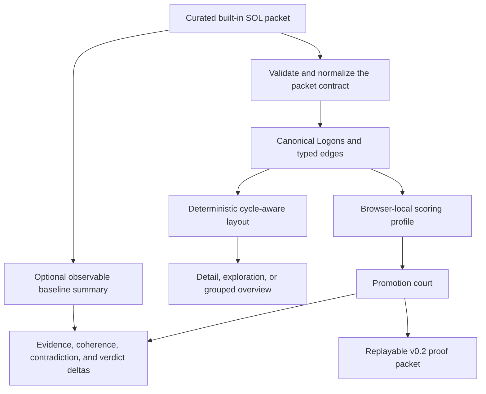

# SOL Lens

**A semantic trace and migration workbench for GPT-5.6 agent workflows, built on the SOL Engine.**

[Open SOL Lens](https://sol-lens.onrender.com/) · [Explore the original SOL Engine](https://github.com/TechmanStudios/sol)

SOL Lens answers a deceptively hard migration question: *did the new model actually make the agent better?* It turns an observable baseline/candidate trace into atomic semantic units called **Logons**, shows how those units support or challenge one another, recomputes a deterministic score, and issues a replayable promotion verdict.

No SOL knowledge or JSON file is required. The app opens with a complete demo and includes seven one-click example packets from a six-Logon chain to a 300-Logon grouped program migration. The judge-facing demo deliberately uses curated packets rather than accepting arbitrary historical SOL Engine JSON, whose meaning cannot be safely inferred from shape alone.

## Start without making a packet

A **SOL packet** is a portable JSON record of observable agent activity. A **Logon** is one atomic unit in that record: a requirement, tool request, tool result, evidence claim, constraint check, contradiction, or output. Typed edges record how those units depend on, support, constrain, or feed back into one another. A packet may also include an observable `baseline_evaluation` summary so SOL Lens can show real metric and verdict deltas; when it is absent, the app explicitly labels the packet candidate-only.

Select **Explore 7 examples** in the live app and choose a structure:

| Example | Size | Semantic structure | Expected court |
| --- | ---: | --- | --- |
| Grounded answer | 6 Logons | Linear request → evidence → checked answer chain | PROMOTE |
| Agent migration | 10 Logons | Evidence branches, contradiction, and merge | PROMOTE |
| Parallel tool fan-out | 24 Logons | Six tool branches converging around an unresolved constraint | HOLD |
| Self-correction loop | 48 Logons | Six phases with an explicit feedback edge into planning | PROMOTE |
| Multi-agent handoff | 72 Logons | Six specialized agent lanes with observable state transfers | PROMOTE |
| Conflicting sources | 120 Logons | Six parallel source branches with repeated constraint collisions | QUARANTINE |
| Program-scale migration | 300 Logons | Twelve supplied groups with overview and drill-down | PROMOTE |

These are deterministic teaching fixtures, not live model captures. They use the same validation, normalization, local evaluation, layout, and export paths as the packet contract while avoiding misleading best-effort conversion of unrelated JSON.

## What the prototype demonstrates

- observable baseline versus locally replayed candidate metrics, deltas, and verdict movement
- beginner-friendly, one-click example gallery spanning seven graph shapes and scale modes
- strict v0.2 validation and safe v0.1 normalization retained in the packet library for future adapters
- deterministic, cycle-aware Logon layout with supported, inferred, and contradictory units
- automatic detail, exploration, and grouped overview modes
- pointer-centered zoom, background pan, fit/reset, group focus, and keyboard selection
- per-Logon evidence density (`rho`), semantic pressure (`p`), and governance alignment (`psi`)
- aggregate evidence, coherence, and contradiction scoring
- deterministic **PROMOTE / HOLD / QUARANTINE** court
- claimed-versus-recomputed evaluation comparison
- downloadable v0.2 JSON proof packet with typed edges
- accessible keyboard interaction and responsive dashboard layout

## Where SOL Lens comes from

SOL Lens is a new product layer over a larger, pre-existing research program. The distinction matters:

Here, **SOL** means **Self-Organizing Logos**. It names the research framework and is not a reference to the GPT-5.6 Sol model name.

- The **SOL Engine** is the experimental foundation. It treats a semantic graph as a coupled dynamical system whose nodes carry density, pressure, and belief-field state and whose edges carry flux.
- **SOL Lens** is the Build Week application. It translates observable agent traces into a portable Logon graph and applies a deliberately small, deterministic browser scoring profile. It does **not** run the full SOL manifold simulation and does not claim access to hidden model reasoning.

Judge-facing source trail:

- [Original SOL repository](https://github.com/TechmanStudios/sol) — open research engine, tooling, tests, data, and audit history
- [Conceptual specification](https://github.com/TechmanStudios/sol/blob/main/README_SOL.md) — self-organizing semantic graphs, runtime, memory, and multi-scale organization
- [Mathematical foundation v2](https://github.com/TechmanStudios/sol/blob/main/solMath_v2.tex) — Riemannian semantic state, continuity and momentum equations, reaction-diffusion modes, incidence-matrix graph calculus, and edge flux
- [Master research chronicle](https://github.com/TechmanStudios/sol/blob/main/SOL_Master_Chronicle.md) — phased protocols, observations, measurements, interpretations, open hypotheses, and falsification plans
- [SOL Engine test suites](https://github.com/TechmanStudios/sol/tree/main/tests) — manifold/telemetry, experiment-ledger, memory, orchestration, trust, and regression coverage
- [Experiment ledger](https://github.com/TechmanStudios/sol/blob/main/tools/analysis/experiment_ledger.py) and [proof-packet ledger](https://github.com/TechmanStudios/sol/blob/main/solKnowledge/proof_packets/LEDGER.md) — the path from run bundles to consolidated evidence
- Representative experiment reports: [adaptive handshake](https://github.com/TechmanStudios/sol/blob/main/data/adaptive_handshake/report.md) and [emergent cognition](https://github.com/TechmanStudios/sol/blob/main/data/emergent_cognition/report.md)

See [PROVENANCE.md](./docs/PROVENANCE.md) for the clean boundary between the foundation and the Build Week extension.

## SOL Lens scoring profile

The browser workbench aggregates only observable Logon fields. For a trace `L`:

```text
evidence      = mean(evidence_i) for non-contradictory Logons
contradiction = contradictory Logons / (all Logons + stabilizer)
coherence     = .45(evidence) + .42(mean psi) + .13(1 - mean pressure)
```

The promotion court then applies explicit gates:

| Verdict | Gate |
| --- | --- |
| PROMOTE | contradiction <= 0.10 and evidence >= 0.82 and coherence >= 0.72 |
| HOLD | contradiction <= 0.20 but one promotion gate is missed |
| QUARANTINE | contradiction > 0.20 or coherence < 0.72 |

This is a versioned Build Week demonstration profile, not a claim that one universal threshold fits every agent. A production adapter should calibrate a scoring profile per workflow against representative evals.

SOL Lens never invents the baseline. Every built-in teaching packet includes a checked-in observable baseline summary, so the interface can show evidence-based comparison deltas rather than decorative or inferred numbers.

## Testing and experimental discipline

SOL Lens has its own deterministic Node test suite. It checks schema failures, v0.1 migration, stable edge IDs, scoring, feedback cycles, scale thresholds, grouping, claimed evaluation mismatches, seven example-packet replay round trips, rendered application copy, and complete export/replay.

The original SOL repository maintains a separate `pytest` suite across manifold dynamics, telemetry, experiment indexing, memory/consolidation, orchestration, trust policy, adaptive simulation, and regression behavior. Its research chronicle separates **observations**, **measurements**, and **interpretations**, records baseline-restore and UI-neutral harness rules, and keeps open hypotheses distinct from locked findings. The links above lead to the underlying tests, experiment code, reports, and proof packets rather than asking judges to accept the Lens UI as the evidence for the engine.

## Architecture



The canonical live application is deployed at [sol-lens.onrender.com](https://sol-lens.onrender.com/). The workbench is credential-free and browser-local; a future Responses API adapter can emit the same observable packet contract without changing the replay layer.

## Local development

Requirements: Node.js 22.13 or newer and a POSIX-compatible shell.

```bash
npm run install:ci
npm run dev
```

Validation:

```bash
npm run lint
npm test
npm run build
```

## Repository map

- `app/sol-lens-workbench.tsx` — packet-driven comparison workbench
- `app/components/packet-loader.tsx` — curated example gallery and demo reset controls
- `app/components/semantic-graph.tsx` — scalable graph viewport and controls
- `app/globals.css` and `app/phase2.css` — Cosmic Semantic Lab × Solar Atlas visual system
- `lib/example-packets.ts` — seven deterministic teaching packets from 6 to 300 Logons
- `lib/packet-schema.ts` — validation, normalization, evaluation comparison, and v0.2 export
- `lib/graph-layout.ts` — deterministic SCC-aware layout
- `lib/graph-groups.ts` — packet and structural overview grouping
- `lib/sol-engine.ts` — versioned Lens scoring profile and promotion court
- `docs/PHASE-2.md` — packet contract and verification guide
- `docs/PROVENANCE.md` — pre-existing/new-work boundary and foundation trail
- `docs/SUBMISSION-CHECKLIST.md` — remaining Devpost packaging steps

## Build Week status

The packet-driven workbench is live on Render. Before final submission, the project still needs its selected source snapshot pushed, a narrated demo video, the final `/feedback` session ID, and a credentialed GPT-5.6 Responses API validation run.
