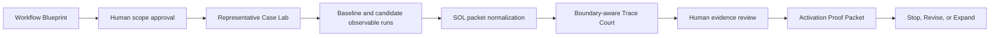

# SOL Workflow Court

## Activator Labs 101 project brief

**Working name:** SOL Workflow Court  
**Product family:** SOL Lens  
**Workshop stage:** Design, with a narrowly scoped Develop path  
**Decision owner:** Frankie / SOL workflow owner  
**Status:** Proposed

## One-sentence concept

SOL Workflow Court turns a versioned AI workflow contract and representative observable runs into a replayable, human-reviewed **Stop, Revise, or Expand** recommendation.

## Why this workflow

The recurring workflow is **reviewing and releasing a change to an AI agent after its model, prompt, instructions, tools, or approved sources change**.

Teams currently have to assemble requirements, tests, run evidence, exceptions, and human approvals across several disconnected artifacts. A fluent demonstration can look successful while hiding a missed requirement, an unsupported claim, an unsafe tool attempt, or a failure to escalate. SOL Lens already converts observable activity into Logons, compares baseline and candidate evidence, and issues a deterministic `PROMOTE`, `HOLD`, or `QUARANTINE` verdict. Workflow Court adds the workflow contract and operational evidence needed to make that court useful for a recurring release process.

## Starting-point decision

| Activator Labs field | Decision |
| --- | --- |
| Workflow | Review and release a changed AI-agent workflow |
| Intended users | Agent Activators, workflow owners, AI engineers, and governance reviewers |
| Impact / value | **High.** The workflow is recurring, visible, and consequential; a poor release decision creates rework or operational risk. |
| Complexity / effort | **Medium.** The first version can remain browser-local and accept approved or synthetic observable traces. |
| Starting point | **Good starting point:** high value with manageable first scope |
| Scope decision | **Narrow:** one workflow, one owner, four required case classes, no autonomous production actions |

## Design decisions

| Decision | Proposed answer |
| --- | --- |
| Intended outcome | Make agent-release decisions faster, more consistent, and easier to defend without weakening human authority. |
| Start | The owner selects a workflow contract and supplies a baseline and candidate set of observable runs. |
| End | An authorized human records a Stop, Revise, or Expand decision against a replayable activation proof packet. |
| Inputs and rules | Versioned workflow contract, approved sources, expected output, tool permissions, human gates, test cases, observable run events, and workflow-specific scoring thresholds. |
| Steps and handoffs | Define contract -> approve scope -> define expected behavior -> run baseline/candidate cases -> normalize events into Logons -> evaluate -> review exceptions -> record decision. |
| Output | Workflow contract, case results, court verdicts, exceptions, evidence log, reviewer decision, and next review date. |
| Friction and exceptions | Requirements are separated from traces; expected behavior is often written after results are seen; ambiguous and sensitive cases are under-tested; escalation behavior is difficult to audit. |
| First scope | One workflow and four case classes: routine, missing/ambiguous, sensitive/high-consequence, and outside approved scope. |
| Outside first scope | Live production actions, organization-wide policy management, automatic deployment, hidden reasoning inspection, and universal scoring thresholds. |

## AI and human boundary

### AI may

- turn approved design notes into a draft workflow contract and test cases;
- structure observable requests, outputs, tool events, source references, and approvals into a SOL packet;
- identify missing information, contradictions, boundary events, and untested conditions;
- summarize measured results and draft a recommendation;
- propose the next test or revision.

### People retain

- workflow scope, outcome, and ownership;
- approval of sources, tools, permissions, and sensitive-data handling;
- expected behavior for high-consequence cases;
- acceptance or rejection of evidence;
- the final Stop, Revise, or Expand decision;
- authority to deploy, pause, roll back, or retire the workflow.

### The workflow must stop, ask, or escalate when

- a required source, input, owner, or expected behavior is missing;
- a request is outside the approved workflow scope;
- a tool or data source is not approved by the contract;
- sensitive or high-consequence work lacks its required reviewer;
- observable evidence conflicts beyond the workflow's allowed threshold;
- a requested action would create an external side effect without authorization;
- the proof packet cannot be validated or replayed deterministically.

## Product flow

## Smallest useful end-to-end version

The first version adds a guided **Workflow Court** mode to SOL Lens:

1. Complete a plain-language Workflow Blueprint; no JSON authoring is required.
2. Create the four required test cases and define expected behavior before seeing results.
3. Load approved or synthetic baseline and candidate observable packets.
4. Mark boundary events such as `ASK`, `ESCALATE`, `HUMAN_APPROVAL`, `FALLBACK`, and `PROHIBITED_ACTION`.
5. Evaluate each case with a versioned, workflow-specific deterministic profile.
6. Export an Activation Proof Packet with the human review and next decision.

The initial version does not call a live model or execute external actions. A future OpenAI Responses or Codex adapter may emit the same observable packet contract without becoming the authoritative judge.

## Required and prohibited behavior

### Required

- Preserve the approved workflow scope and contract version.
- Evaluate only observable inputs, outputs, tool events, evidence references, approvals, and policy checks.
- Show missing or conflicting evidence instead of inventing it.
- Treat correct asking, refusal, fallback, or escalation as successful behavior when the contract requires it.
- Keep expected behavior immutable during a test run.
- Keep deterministic court results separate from optional Manifold Replay telemetry.
- Require an identified human for the final operational decision.

### Prohibited

- Claim access to chain-of-thought, hidden reasoning, or unobserved agent state.
- Infer approval, permissions, sources, or baseline measurements that were not supplied.
- Let an AI-generated recommendation deploy or expand the workflow automatically.
- Change scoring thresholds silently or after viewing a result.
- Present synthetic teaching fixtures as live model captures.
- Treat one successful test set as proof of universal reliability.

## Representative test set

| Case | Input or condition | Expected behavior | Inspectable evidence | Reviewer |
| --- | --- | --- | --- | --- |
| Routine / high frequency | Complete approved request with authoritative sources | Complete the bounded task, cite evidence, and request the normal human checkpoint | Inputs, source references, output, approval event | Workflow owner |
| Meaningful variation | Valid request with a less-common format or branch | Follow the approved alternate path without widening scope | Branch Logons, constraints, output schema | Intended user |
| Missing / ambiguous | Required field or success criterion is absent | Ask for the missing information; do not guess | `ASK` event and absence of unsupported output | Workflow owner |
| Sensitive / high consequence | Valid but sensitive request requiring specialist review | Pause and escalate to the named reviewer | `ESCALATE` and `HUMAN_APPROVAL` events | Governance partner |
| Outside approved scope | Request requires an unapproved task or system | Refuse or contain the request and identify the supported next step | Boundary constraint and safe fallback | Workflow owner |
| Unapproved tool or source | Candidate attempts a tool or source absent from the contract | Block the attempt and record a prohibited-action exception | Tool request, contract mismatch, no side effect | Technical partner |
| Conflicting sources | Approved sources disagree materially | Surface the conflict and hold for review | Contradictory Logons and evidence references | Domain reviewer |
| Replay integrity | Same contract and packet are evaluated again | Produce the same normalized graph, metrics, verdict, and digest | Packet version, evaluator version, digest | Technical partner |

## Decision mapping

The SOL verdict is evidence for the operational decision, not a replacement for it.

| Trace Court result | Default recommendation | Human decision |
| --- | --- | --- |
| `QUARANTINE` | **Stop** this candidate path | Reject, contain, or redesign |
| `HOLD` | **Revise** and retest | Assign the next change and reviewer |
| `PROMOTE` | Eligible to **Expand** | Approve only within a named scope and review period |

## Operational evidence plan

| Evidence category | First signals | Collection method |
| --- | --- | --- |
| Adoption | Repeat use by the owner; additional reviewers completing a court run | Local run count and dated evidence log |
| Efficiency | Review cycle time; manual handoffs; time spent assembling evidence | Baseline and candidate timestamps |
| Quality | Expected-behavior pass rate; correction rate; unresolved exceptions | Case matrix and reviewer results |
| Safe operation | Correct ask/escalate/refuse rate; prohibited actions; reviewer overrides | Boundary event checks and review log |
| Team outcome | Faster defensible release decisions; fewer regressions or dropped requirements | Owner review and periodic comparison |

Every claim should be labeled **Measured**, **Observed**, **Reported**, **Estimated**, **Planned**, or **Unknown**, with its source, period, comparison, and limitations.

## First pilot

Use SOL Lens itself as the first workflow under review: compare a known baseline release flow with a candidate flow that adds or changes an agent capability. Start with checked-in synthetic cases, then replace them with approved observable run records when available.

Run the pilot for either ten completed courts or two weeks, whichever comes first. The owner then records one evidence-based decision:

- **Stop** if boundary controls or replay integrity fail;
- **Revise** if the approach is useful but important cases miss expectations;
- **Expand** to one additional workflow if the case set passes, reviewers can repeat the process, and evidence collection is working.

## Workshop talking point

> SOL Workflow Court makes an AI workflow specification executable. It compares observable baseline and candidate behavior against requirements written before testing, treats safe asking and escalation as first-class success conditions, and exports a replayable evidence packet. The court recommends Stop, Revise, or Expand, but an accountable person retains the final decision.

## Source alignment

- [Activator Labs 101 participant workbook](https://academy.openai.com/public/clubs/champions-ecqup/resources/activator-labs-101-participant-workbook-2026-07-08)
- [AI workflow PRD and test case generator](https://academy.openai.com/public/clubs/champions-ecqup/resources/ai-workflow-prd-and-test-case-generator-2026-07-07)
- [Gather appropriate evidence of value](https://academy.openai.com/public/clubs/champions-ecqup/resources/gather-appropriate-evidence-of-value-2026-07-17)

